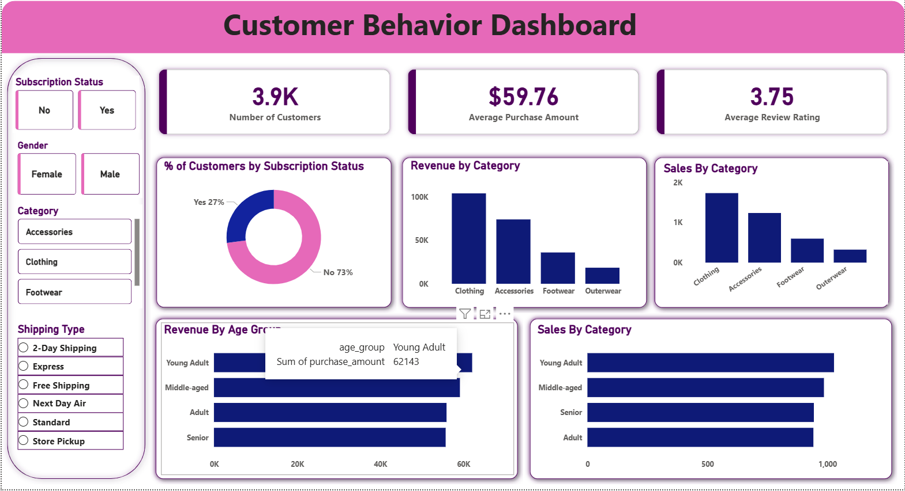

# Customer Shopping Behaviour Analysis
## Tools: Python • SQL (MySQL) • Power BI

## Objective
End-to-end analysis of 4K+ customer purchase records to identify
revenue drivers, customer segments, and buying patterns.

## What I did
- Cleaned and transformed raw data using Python (Pandas, NumPy)
- Created structured MySQL database from cleaned dataset
- Wrote advanced SQL queries (CTEs, Window Functions, CASE)
  to answer business questions on retention, product performance,
  and discount impact
- Built Power BI dashboard with DAX KPIs for stakeholder reporting

## Files
| File | Description |
|------|-------------|
| data_cleaning.ipynb | Python cleaning + feature engineering |
| sql_queries.sql | All business queries with comments |
| customer_behaviour_dashboard.pbix | Power BI report file |
